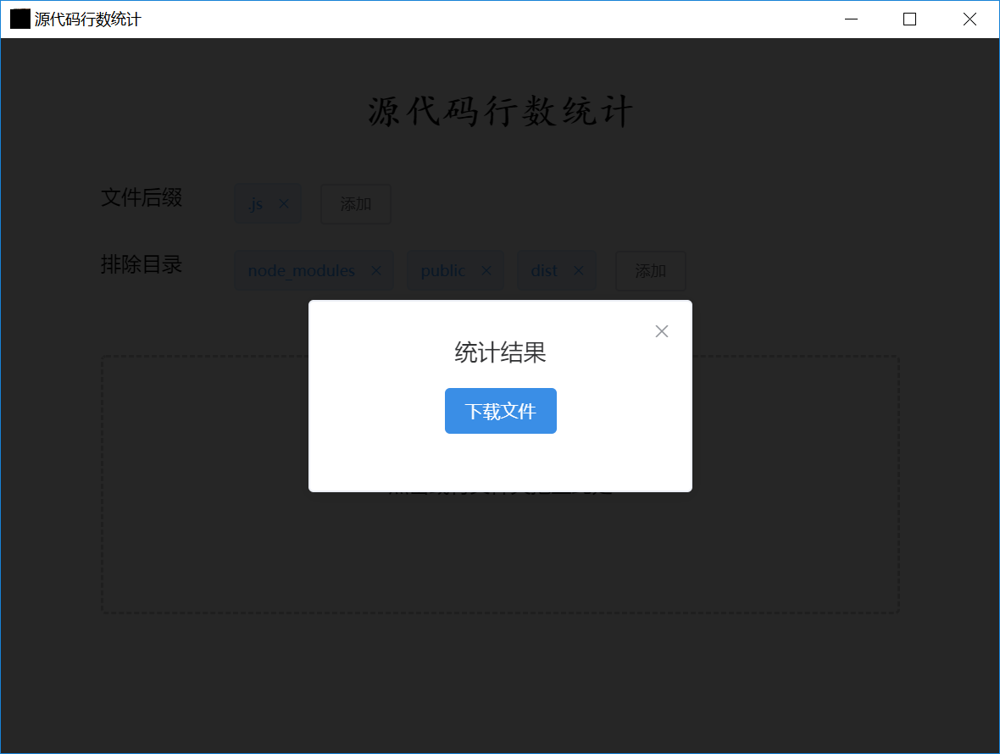

# row_count
Count the number of file lines in the folder

## electron 版本

* 启动  

  

* 执行完毕  

  

* 生成的文档  

  

## nodejs版本

### config  

``` js  
module.exports = {
  // 需要统计代码的目录
  dir: 'C:/Users/star/Desktop/des',
  // 需要包含的文件后缀
  extensions: ['.js'],
  // 需要排除的文件目录
  excludeSubDir: ['node_modules', 'public', 'dist']
}
``` 

###  run
> node app  

###  xlsx file
the xlsx file in 
> ./xlsx
